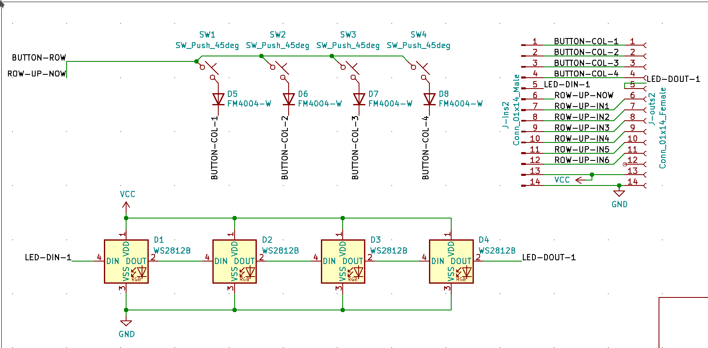

A 4xn button matrix with ws2812 back-light. Since keyboard keys are not compatible with this type of leds, they are mounted from the back side of the board. For this reason it is unlikely that you can produce the board with a pick and place machine.

This module is meant to be chained together to produce isometric keyboards. A ribbon cable is connected to the microcontroller, and it gets access to 7 rows before needing another connector 

it has not been produced and tested yet.
